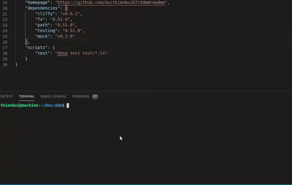

# Deno dependencies manager - ddm

[](https://gitlicense.com/license/ducthienbui97/ddm)

Manage your deno package with `ddm` and the good old `package.json` file.



## Install

```sh
deno install --allow-all -n ddm -f https://raw.githubusercontent.com/ducthienbui97/ddm/master/bundle/ddm.js
```

## Usage

### Overview

```sh
  Description:
  
    Manage you project with package.json file.
  
  Options:
  
    -h, --help     [arg:boolean]  - Show this help.
    -V, --version  [arg:boolean]  - Show the version number for this program.  
  
  Commands:
  
    help         [command:command]          - Show this help or the help of a sub-command.
    completions                             - Generate shell completions for zsh and bash.
    install      [names@version...:string]  - Install one or more package
    run          [parameters...:string]     - Run 'deno run' command
    cache        [parameters...:string]     - Run 'deno cache' command
    bundle       [parameters...:string]     - Run 'deno bundle' command
    test         [parameters...:string]     - Run 'deno test' command
    build        [parameters...:string]     - Run 'build' script defined in package.json
```

### `ddm install`

#### Without version:

```sh
ddm install http
```

#### With version:

```sh
ddm install http@v0.50.0
```

#### Multiple package:

```sh
ddm install http log fmt
```
### `deno run/cache/bundle/test` scripts:

```sh
ddm run/cache/bundle/test <Deno OPTIONS>
```

### `package.json` scripts:

package.json:

```json
{
  "scripts": {
    "something" : "some script",
    "presomething": "some prepare script",
    "postsomething": "some cleanup script"
  }
}
```
run:

```sh
ddm something
```
NOTE: scripts writen in `package.json` will override default commands.
